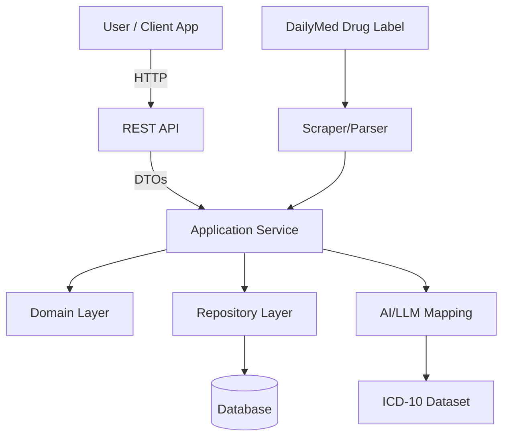

# 💊 Drug Indication Mapping Microservice

## 🚀 Overview

This project implements a microservice to **extract drug indications** from **DailyMed** drug labels, **map them to ICD-10 codes using AI/LLM**, and expose a **secure API** for CRUD operations and queries.

Built with:
- **Node.js (NestJS)** for the API
- **Dockerized deployment**
- **Clean/Hexagonal Architecture**
- **Test-Driven Development (TDD)**
- **TurboRepo** for monorepo management

---

## 🎯 **Problem We Solve**

Healthcare data is fragmented. Drug indications in free-text labels must be standardized to integrate into medical systems.

✅ Automatically extract indications from DailyMed using Puppeteer  
✅ Map to standard **ICD-10** codes using OpenAI API  
✅ Serve structured data via API  
✅ Support CRUD + role-based access

---

## 🏗️ **Architecture**



### Clean/Hexagonal Architecture

The application follows a clean architecture approach with three main layers:

1. **Domain Layer**: Contains business logic and rules, independent of external frameworks or technologies.
   - Domain models (Drug, Indication, User)
   - Repository interfaces
   - Service interfaces

2. **Application Layer**: Contains use cases that orchestrate the flow of data to and from the domain layer.
   - Use cases for CRUD operations
   - Use cases for mapping indications to ICD-10 codes

3. **Infrastructure Layer**: Contains adapters that implement interfaces defined in the domain layer.
   - Database adapters (TypeORM)
   - HTTP adapters (NestJS controllers)
   - External service adapters (OpenAI API)

This architecture provides:
- ✅ **Separation of concerns**  
- ✅ **Testability** of domain and application layers  
- ✅ **Maintainability** as changes to one layer don't affect others  
- ✅ **Flexibility** to replace infrastructure components

---

## 📚 **Features**

✅ Scrape **DailyMed drug labels** for indications using Puppeteer  
✅ Map to **ICD-10 codes** using OpenAI API  
✅ Store mappings in a **database**  
✅ Expose **REST API** with:
- CRUD for drugs and indications
- Authentication (JWT)
- Role-based authorization
- `/programs/:programId` returns structured JSON
✅ API documented via **Swagger**

---

## 🐳 **Getting Started**

### 🔧 **Requirements**

- Docker
- Docker Compose

### 🏃‍♂️ **Run with Docker Compose**

```bash
# Clone the repository
git clone <repository-url>
cd drugtest

# Create a .env file with required environment variables
# See the Environment Variables section below

# Build and start the containers
docker-compose up --build
```

➡️ Access API at: `http://localhost:3000/api`  
➡️ Access Swagger docs at: `http://localhost:3000/api/docs`

### 🔑 **Environment Variables**

Create a `.env` file in the root directory with the following variables:

```
# JWT Configuration
JWT_SECRET=your-secret-key-change-in-production
JWT_EXPIRATION=1h

# Rate Limiting Configuration
THROTTLE_TTL=60
THROTTLE_LIMIT=10

# CORS Configuration
CORS_ORIGINS=http://localhost:3000,http://localhost:4200

# Server Configuration
PORT=3000

# OpenAI Configuration
OPENAI_API_KEY=your_api_key_here
```

### 🧪 **Running Without Docker**

```bash
# Install dependencies
yarn install

# Start the API in development mode
yarn workspace api start:dev
```

---

## 📂 **Project Structure**

The project is organized as a monorepo using TurboRepo:

```
/
├── apps/
│   └── api/                # NestJS API application
│       ├── src/
│       │   ├── application/    # Application layer (use cases)
│       │   ├── domain/         # Domain layer (models, interfaces)
│       │   └── infrastructure/ # Infrastructure layer (controllers, repositories)
│       └── ...
├── packages/
│   ├── scraper/            # Puppeteer scraper module
│   ├── ai-mapper/          # AI/LLM mapping service
│   └── config/             # Shared configurations
└── ...
```

### API Structure

The API follows a modular structure with the following components:

- **Users Module**: User management and authentication
- **Drugs Module**: CRUD operations for drugs
- **Indications Module**: CRUD operations for indications
- **Indication Mapping Module**: Mapping indications to ICD-10 codes
- **Programs Module**: Structured JSON output combining drugs and indications

✅ Aligned to **hexagonal architecture**  
✅ Dependencies flow **inward**

---

## 🧪 **Testing**

```bash
npm run test
```

Test coverage includes:

- Data extraction (scraper)
- AI mapping logic
- API endpoints
- Auth/role flows
- Business rules

Tooling: **jest** + **supertest**

---

## 📝 **API Documentation**

### Authentication

#### Register a new user

```
POST /api/auth/register
{
  "username": "user",
  "password": "password"
}
```

#### Login

```
POST /api/auth/login
{
  "username": "user",
  "password": "password"
}
```

This will return a JWT token that you can use to authenticate subsequent requests.

### API Endpoints

| Method | URL                                 | Description                      |
|--------|------------------------------------|----------------------------------|
| GET    | /api/drugs                         | List all drugs                   |
| POST   | /api/drugs                         | Create a new drug                |
| GET    | /api/drugs/:id                     | Get a drug by ID                 |
| PUT    | /api/drugs/:id                     | Update a drug                    |
| DELETE | /api/drugs/:id                     | Delete a drug                    |
| GET    | /api/drugs/:id/indications         | List indications for a drug      |
| POST   | /api/drugs/:id/indications         | Add new indication to a drug     |
| GET    | /api/indications                   | List all indications             |
| GET    | /api/indications/:id               | Get an indication by ID          |
| PUT    | /api/indications/:id               | Update an indication             |
| DELETE | /api/indications/:id               | Delete an indication             |
| GET    | /api/programs/:programId           | Get structured JSON output       |

✅ All endpoints require **JWT auth**  
✅ Role-based access enforced

For detailed API documentation, visit the Swagger UI at `/api/docs` when the server is running.

---

## 🖼️ **Sample Output**

### Sample Drug

```json
{
  "id": "123",
  "name": "Dupixent",
  "labelUrl": "https://dailymed.nlm.nih.gov/dailymed/drugInfo.cfm?setid=7d28a866-c5fa-477c-9d6f-e861a9d9d4a8"
}
```

### Sample Indication

```json
{
  "id": "456",
  "description": "Atopic dermatitis",
  "icd10Code": "L20.9",
  "drugId": "123",
  "sourceText": "Treatment of moderate-to-severe atopic dermatitis",
  "mappingConfidence": 0.95
}
```

### Sample Program Output

```json
{
  "id": "123",
  "name": "Dupixent",
  "labelUrl": "https://dailymed.nlm.nih.gov/dailymed/drugInfo.cfm?setid=7d28a866-c5fa-477c-9d6f-e861a9d9d4a8",
  "indications": [
    {
      "description": "Atopic dermatitis",
      "icd10Code": "L20.9"
    },
    {
      "description": "Asthma",
      "icd10Code": "J45"
    },
    {
      "description": "Chronic rhinosinusitis with nasal polyposis",
      "icd10Code": "J33.9"
    }
  ]
}
```

---

## ⚙️ **Scalability Considerations**

### Current Scalability Features

- **Modular Architecture**: Components can be scaled independently
- **Stateless API**: Allows horizontal scaling
- **Docker Containerization**: Facilitates deployment to orchestration platforms

### Future Scalability Improvements

- **Async Processing Queue**: Implement a queue (e.g., RabbitMQ, Kafka) for scraping and mapping tasks
- **Caching Layer**: Add Redis caching for frequently accessed data and AI mapping results
- **Database Scaling**: Implement database sharding or read replicas for high traffic
- **Microservices Split**: Separate scraper and AI mapping into independent microservices
- **API Gateway**: Add an API gateway for rate limiting, caching, and routing
- **Serverless Functions**: Move specific workloads to serverless for automatic scaling

---

## 🏗️ **Potential Improvements & Production Challenges**

### Potential Improvements

- **Versioning System**: Track changes to drug labels and indications over time
- **Manual Review UI**: Create an admin interface for reviewing and correcting mappings
- **Batch Processing**: Support bulk import and processing of multiple drugs
- **Advanced NLP**: Enhance the AI mapping with more sophisticated NLP techniques
- **FHIR Integration**: Support healthcare interoperability standards
- **Audit Logging**: Track all changes to the system for compliance
- **Analytics Dashboard**: Visualize mapping statistics and system usage

### Production Challenges

| Challenge                   | Solution                                | Tradeoff                           |
|----------------------------|----------------------------------------|-----------------------------------|
| OpenAI API reliability      | Implement retry logic and fallbacks     | Increased complexity, higher costs |
| Changing DailyMed formats   | Regular scraper updates, monitoring     | Maintenance overhead               |
| Mapping accuracy            | Human review workflow for low confidence| Manual intervention required       |
| Scaling costs               | Optimize AI usage, implement caching    | Development effort vs. cost savings|
| Security compliance (HIPAA) | Encryption, access controls, auditing   | Performance impact, complexity     |
| High availability           | Multi-region deployment, load balancing | Increased infrastructure costs     |

---

## ❓ **Gaps & Tradeoffs**

| Gap                      | Solution                              | Layer                | Tradeoff                |
|-------------------------|--------------------------------------|---------------------|-----------------------|
| Changing label formats    | Configurable parser patterns          | Scraper              | Requires monitoring    |
| Ambiguous mappings        | Admin review endpoint `/unmapped`     | API + Domain         | Adds manual workflow   |
| Non-standard synonyms     | NLP synonym enrichment (WordNet)      | AI Service           | Increases complexity   |
| Explainability of AI      | Store prompt + LLM output in DB       | Domain + Infra       | Higher storage cost    |

---

## 👥 **Leading an Engineering Team**

### Team Structure and Roles

- **Tech Lead**: Architecture decisions, code quality, technical direction
- **Backend Engineers**: API development, database design, business logic
- **ML/AI Engineer**: Indication mapping algorithm, OpenAI integration
- **DevOps Engineer**: CI/CD pipeline, infrastructure, monitoring
- **QA Engineer**: Testing strategy, automated tests, quality assurance

### Implementation Approach

1. **Start with Domain Modeling**:
   - Conduct workshops to define core entities and relationships
   - Create a ubiquitous language for the team
   - Document the domain model

2. **API-First Development**:
   - Define OpenAPI specifications before implementation
   - Use contract testing to ensure API compliance
   - Create mock servers for frontend development

3. **Parallel Development Tracks**:
   - Team 1: Core API and database infrastructure
   - Team 2: Scraper and AI mapping services
   - Regular integration points to ensure compatibility

4. **Quality and Testing**:
   - Implement CI/CD from day one
   - Require high test coverage (>80%)
   - Automated integration tests for critical flows

5. **Monitoring and Observability**:
   - Implement logging, metrics, and tracing
   - Set up alerts for critical failures
   - Create dashboards for system health

### Maintenance Strategy

1. **Regular Dependency Updates**:
   - Schedule bi-weekly dependency updates
   - Automated security scanning

2. **Monitoring and Alerts**:
   - Monitor scraper success rates
   - Track AI mapping confidence scores
   - Alert on unusual patterns

3. **Continuous Improvement**:
   - Regular retrospectives to identify pain points
   - Allocate 20% of sprint capacity to technical debt
   - Document lessons learned and best practices

4. **Knowledge Sharing**:
   - Regular tech talks and documentation updates
   - Pair programming for complex features
   - Cross-training across components

### Key Success Factors

- **Focus on Business Value**: Prioritize features that deliver the most value
- **Iterative Approach**: Start with MVP and enhance based on feedback
- **Technical Excellence**: Maintain high code quality and test coverage
- **User-Centered Design**: Consider the API consumers' needs
- **Data-Driven Decisions**: Use metrics to guide improvements

---

## 🐳 **Deployment**

- Run via `docker-compose up`
- Services:
    - `api`: NestJS server
    - `db`: Postgres
    - Optional: `pgadmin` or `mongo-express`

Environment variables configurable in `.env`.

---

## 🎥 **Demo**

For demo:

✅ Scrape Dupixent  
✅ Map 2-3 indications  
✅ Query `/programs/:programId` → show structured JSON

---

# Docker Compose Setup

This directory contains the Docker Compose configuration for running the entire system.

## Prerequisites

- Docker
- Docker Compose

## Getting Started

1. Make sure you are in the `infra/docker` directory
2. Run the following command to start all services:

```bash
docker compose up
```

This will start the following services:
- PostgreSQL database
- API service

## Environment Variables

The default environment variables are defined in the `.env` file in this directory. You can modify these values as needed.

## Accessing the Services

- API: http://localhost:4000
- API Documentation: http://localhost:4000/api/docs
- PostgreSQL: localhost:5432
   - Username: dev_local
   - Password: dev_local
   - Database: dev_local

## Stopping the Services

To stop all services, press `Ctrl+C` in the terminal where Docker Compose is running, or run:

```bash
docker compose down
```

To stop all services and remove all data (including the database volume), run:

```bash
docker compose down -v
```
