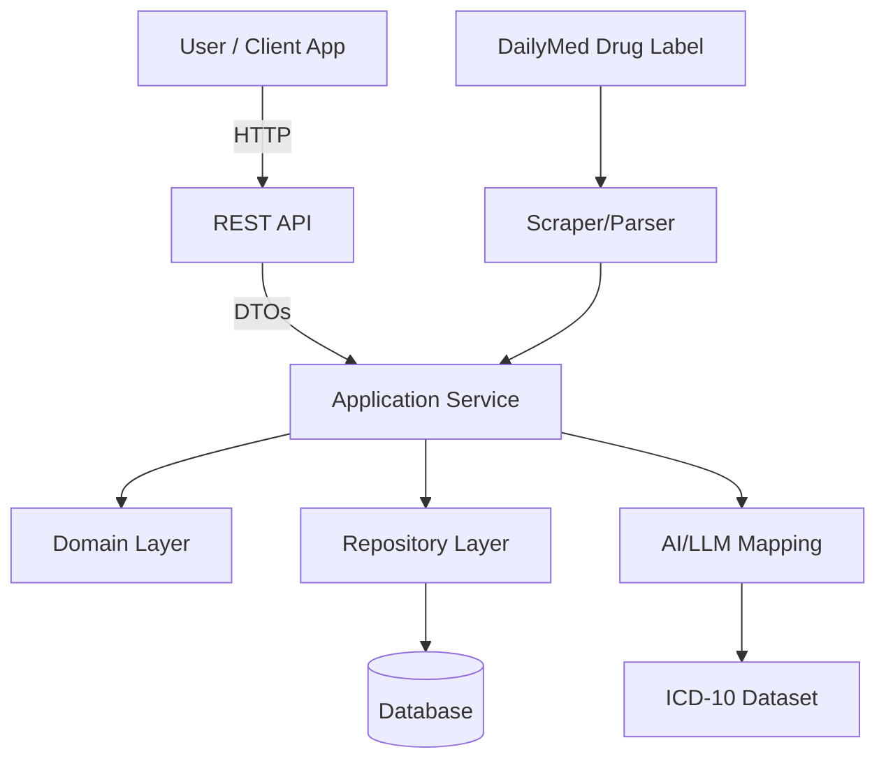

# 💊 Drug Indication Mapping Microservice

## 🚀 Overview

This project implements a microservice to **extract drug indications** from **DailyMed** drug labels, **map them to ICD-10 codes using AI/LLM**, and expose a **secure API** for CRUD operations and queries.

Built with:
- **Node.js (NestJS)** for the API
- **Dockerized deployment**
- **Clean/Hexagonal Architecture**
- **Test-Driven Development (TDD)**

---

## 🎯 **Problem We Solve**

Healthcare data is fragmented. Drug indications in free-text labels must be standardized to integrate into medical systems.

✅ Automatically extract indications  
✅ Map to standard **ICD-10** codes (AI-assisted)  
✅ Serve structured data via API  
✅ Support CRUD + role-based access

---

## 🏗️ **Architecture**



✅ **Separation of concerns**  
✅ AI mapping is decoupled as a service  
✅ Database stores drug ↔ indication mappings and users

---

## 📚 **Features**

✅ Scrape **DailyMed Dupixent** label for indications  
✅ Map to **ICD-10 codes** using OpenAI API  
✅ Store mappings in a **Postgres database**  
✅ Expose **REST API** with:
- CRUD for drug → indication mappings
- Authentication (JWT)
- Role-based authorization
- `/programs/:programId` returns structured JSON
  ✅ API documented via **Swagger**

---

## 🐳 **Getting Started**

### 🔧 **Requirements**

- Docker
- Docker Compose

### 🏃‍♂️ **Run with one command:**

```bash
docker-compose up --build
```

➡️ Access API at: `http://localhost:3000/api`  
➡️ Access Swagger docs at: `http://localhost:3000/api/docs`

---

## 📂 **Project Structure**

```bash
src/
├── api/            # Controllers (REST endpoints)
├── app/            # Application services
├── domain/         # Core domain models & logic
├── infra/          # DB, repositories, adapters
├── scraper/        # HTML scraping logic
├── ai/             # AI mapping service (LLM)
└── main.ts         # App bootstrap
```

✅ Aligned to **hexagonal architecture**  
✅ Dependencies flow **inward**

---

## 🧪 **Testing**

```bash
npm run test
```

Test coverage includes:

- Data extraction (scraper)
- AI mapping logic
- API endpoints
- Auth/role flows
- Business rules

Tooling: **jest** + **supertest**

---

## 📝 **API Documentation**

➡️ Visit `/api/docs` (Swagger UI)

Example endpoints:

| Method | URL                                 | Description                      |
|--------|------------------------------------|----------------------------------|
| GET    | /api/drugs/:id/indications          | List indications for a drug      |
| POST   | /api/drugs/:id/indications          | Add new indication               |
| PUT    | /api/indications/:id                | Update indication                |
| DELETE | /api/indications/:id                | Delete indication                |
| GET    | /api/programs/:programId            | Structured JSON output           |

✅ All endpoints require **JWT auth**  
✅ Role-based access enforced

---

## 🖼️ **Sample Output**

```json
{
  "programId": "dupixent-001",
  "drugName": "Dupixent",
  "indications": [
    {
      "description": "Atopic dermatitis",
      "icd10Code": "L20.9"
    },
    {
      "description": "Asthma",
      "icd10Code": "J45"
    }
  ]
}
```

---

## ⚙️ **Scalability Considerations**

- Async queue for scraping multiple drugs
- Cache AI mappings (Redis) to reduce API calls
- Pagination/filtering in API responses
- Audit log unmapped indications for manual intervention

---

## 🏗️ **Potential Improvements**

✅ Add **version tracking** for label updates  
✅ Provide **manual correction UI** for unmappable indications  
✅ Export data in **FHIR-compatible** formats  
✅ Allow **background re-mapping** as ICD-10 evolves

---

## ❓ **Gaps & Tradeoffs**

| Gap                      | Solution                              | Layer                | Tradeoff                |
|-------------------------|--------------------------------------|---------------------|-----------------------|
| Changing label formats    | Configurable parser patterns          | Scraper              | Requires monitoring    |
| Ambiguous mappings        | Admin review endpoint `/unmapped`     | API + Domain         | Adds manual workflow   |
| Non-standard synonyms     | NLP synonym enrichment (WordNet)      | AI Service           | Increases complexity   |
| Explainability of AI      | Store prompt + LLM output in DB       | Domain + Infra       | Higher storage cost    |

---

## 👥 **Leading the Team**

If leading the team:

✅ Start with **domain modeling workshop**  
✅ Define API contract early (OpenAPI-first)  
✅ Spike parser + AI mapping in parallel  
✅ Prioritize **tests + CI pipeline from day 1**  
✅ Establish logging/monitoring from MVP  
✅ Weekly demos to validate business goals

Focus: solving the *business problem* → not just building tech.

---

## 🐳 **Deployment**

- Run via `docker-compose up`
- Services:
    - `api`: NestJS server
    - `db`: Postgres
    - Optional: `pgadmin` or `mongo-express`

Environment variables configurable in `.env`.

---

## 🎥 **Demo**

For demo:

✅ Scrape Dupixent  
✅ Map 2-3 indications  
✅ Query `/programs/:programId` → show structured JSON

---

## 📖 **License**

MIT
